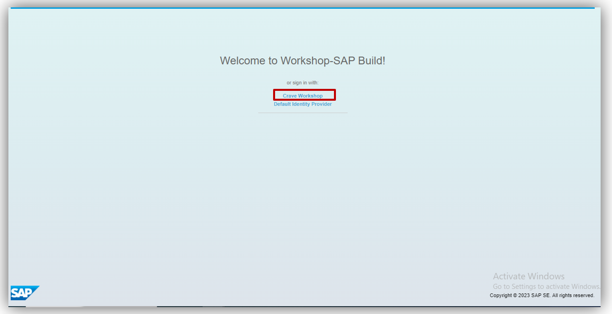
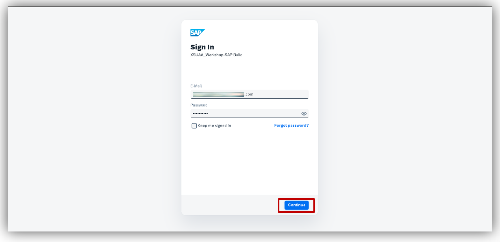
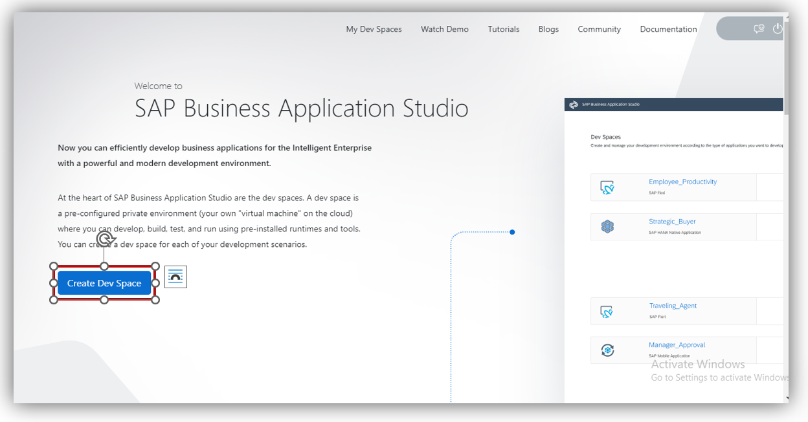
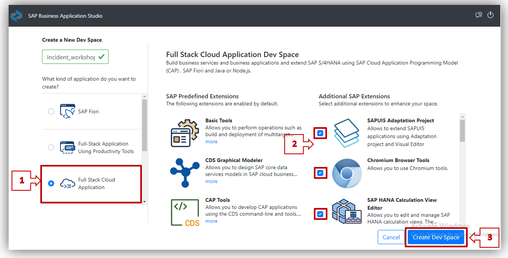
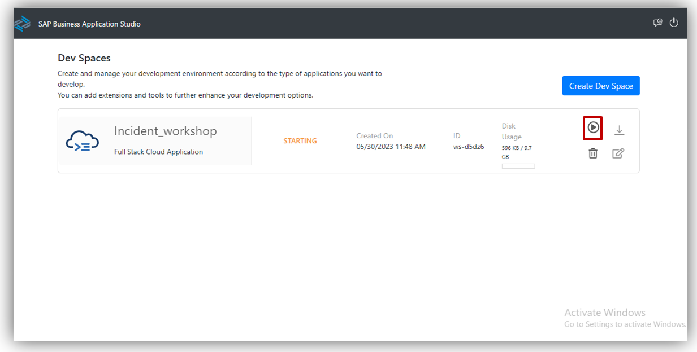
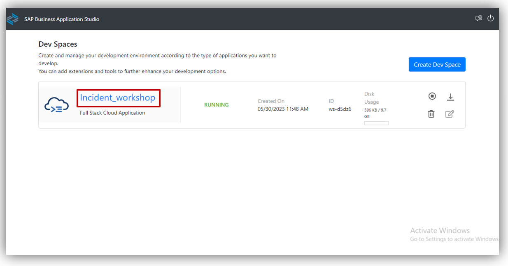
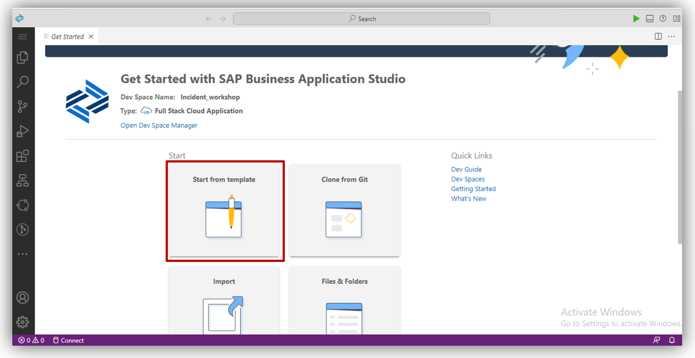

## Table of Contents
  
- [Overview](#overview)
- [Create Dev Space](#devspace)
- [Summary](#Summary)

# Overview 

In this exercise, you will learn 
-  Create  your Dev Space in SAP BAS (Business Application Studio).

## Create Dev Space 
1. From [Welcome to workshop-SAP Build](https://workshop-sap-build-9w562br3.eu10cf.applicationstudio.cloud.sap/index.html), click on <b>Crave Workshop</b>.  

2. You will be redirected to <b>Login Page</b>,   you need to enter your Login Credentials, click on <b>Continue</b>.   

3. A new tab opens. If you have not created a dev space ,the welcome page for SAP Business Application Studio loads and click on <b>Create Dev Space</b>   

4. Give name to Dev Space. and then click on <b>Create Dev Space</b> at bottom right of page.    

5. Select <b>Full Stack Cloud Application</b> as shown below and  select all <b>SAP additional extension. </b>    

6. After Creating Dev Space Click on Run Button as shown below.     

7. As a Dev Space comes in running state click on Dev Space Name.   

8. You’ll be redirected to your newly created SAP Business Application Studio Dev Space.   

## Summary 

You have Created Dev Space and completed the above steps.

Continue to - [Exercise 2 - Create CAP Based Application](../2_Create%20CAP%20Based%20Application//Readme.md) and get started with SAP Build Process Automation.
