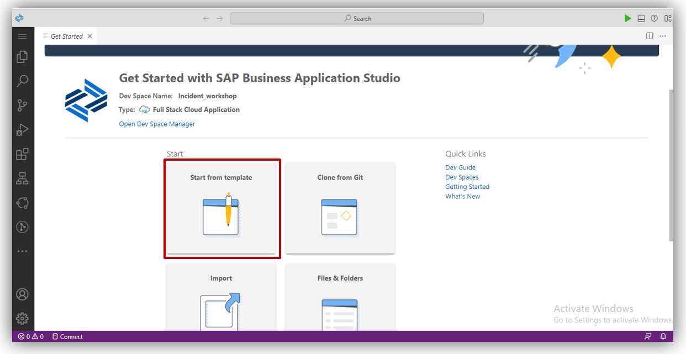
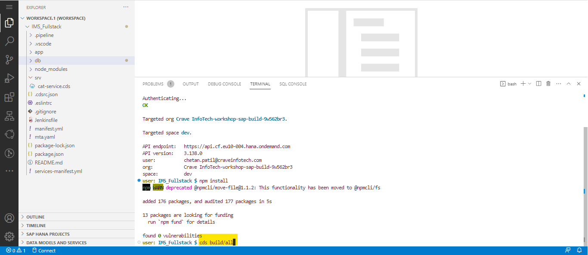
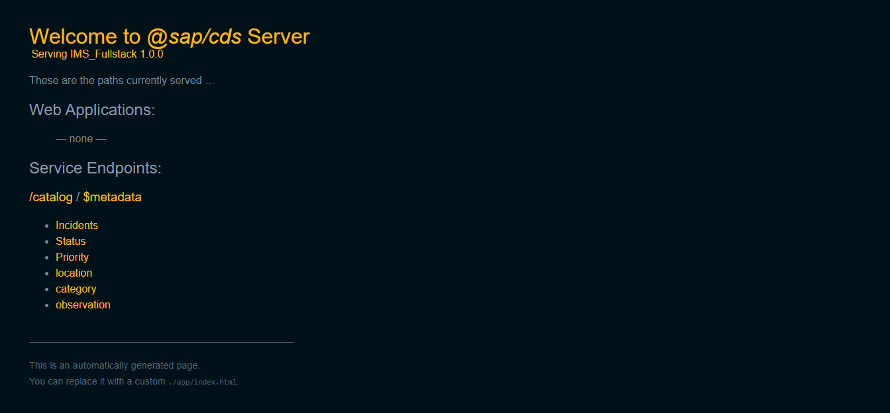

## Table of Contents

- [CAP Project Creation](#project)
- [Table Creation](#table)
- [Install dependencies](#install)
- [ Database connection and project deployment](#db)
- [Summary](#summary)


## CAP Project Creation<a name="project"></a>

1. After Creating Dev Space You’ll be redirected to your newly created SAP Business Application Studio Dev Space. Click on <b>Start Template</b> as shown below. <br><br><br>

2. Select <b>CAP Project</b> from given template and click on <b>Start.</b> <br><br><br>

3. Enter your Project name as shown below, and choose <b>Node.js</b> from runtime.<br>
Select all check boxes given below and click on <b>Finish</b> button. <br><br><br>

3.Now we have  Sucessfully Created a CAP Project <br><br><br>

## CAP Table Creation<a name="table"></a>

1. Now, to create a table go to <b>db</b> folder and click on <b>data-model.cds</b> replace the code and you can refer below code to create a table as shown in below, here we use <b>entity<b> keyword to create a table followed by table name Incident <br><br><br> 

```
namespace my.IMS_Fullstack;

using {managed} from '@sap/cds/common';

entity Incidents : managed {
    key ID          : UUID; //@(Core.Computed : true);
        title       : String(50);
        category    : Association to one category;
        Priority    : Association to one Priority;
        Status      : Association to one Status;
        location    : Association to one location;
        observation : Association to one observation;
        Address     : String(100);
        Date_Time   : DateTime @cds.on.insert: $now;
};

entity Status {
    key ID    : Integer;
        SName : String(50);
};

entity Priority {
    key ID    : Integer;
        PName : String(50);
};

entity category {
    key ID    : Integer;
        CName : String(50);
};

entity location {
    key ID    : Integer;
        LName : String(50);
};

entity observation {
    key ID    : Integer;
        OName : String(50);
};

```
<br>

2. Now, to expose <b>Incident</b> table to services we have to do projection of tables for which,
Go to <b>srv</b> folder and click on <b>cat-service.cds</b> and write the following code <br><br><br>

```
using my.IMS_Fullstack as ims from '../db/data-model';

service CatalogService {

entity Incidents as projection on ims.Incidents; //{
    // *,
    // //T0.Incident_Status,
    // T0.Status.ID as IS_ID,
    // T0.Status.SName as SName
//};
annotate Incidents with @odata.draft.enabled;
@odata.draft.enabled
entity Status as projection on ims.Status;
@odata.draft.enabled
entity Priority as projection on ims.Priority;
@odata.draft.enabled
entity location as projection on ims.location;
@odata.draft.enabled
entity category as projection on ims.category;
@odata.draft.enabled
entity observation as projection on ims.observation;
}

```
<br>


## Install dependencies <a name="install"></a>

1. Right Click on Project Name, select <b>Open in integrated Terminal</b> <br><br><br>

2. The terminal will open in the bottom right of the Business Application studio run  <b>cf login</b>  command and press enter  <br>

```
cf login

```
 <br><br>

3. Copy this link <b>https://api.cf.eu10-004.hana.ondemand.com </b> and paste in <b>API end point</b> and press enter 
```
https://api.cf.eu10-004.hana.ondemand.com

```
<br><br>

4. Enter your  <b>Email</b> and  <b>Password</b> and press enter <br><br><br>

5. Run <b>npm install </b> command and press enter 
```
npm install

```
<br><br>

6. After installation of npm packages run <b>cds build/all</b> command and press enter  
```
cds build/all

```
<br>  <br>

7. After that run <b>cds deploy --to hana</b> command and press enter
```
cds deploy --to hana

```
<br><br>


## Database connection and project deployment <a name="db"></a>

1. Click on highlighted section and select <b>Run Configuration</b> <br><br><br>

2. Click on <b>Create Configuration</b> <br><br><br>

3. After that you will get pop up <b>IMS_Fullstack-development profile (CAP)</b>Click on that and press enter.<br><br><br>

4. Click on <b>Run IMS_Fullstack</b> and press enter.<br><br><br>

5. Now you can able to see Created Database Configuration open that folder and Click on  highlighted section in <b>db-hana</b> as shown in below <br><br><br>

6. You will get pop up Click on <b>IMS_Fullstack-db hana(hdi-shared)</b> <br><br><br>

7. Click on <b>Yes</b> <br><br><br>

8. Now you are successfuly conected to  <b>Hana Database</b> <br><br><br>

9. On left side you can able to see <b>mta.yml</b> file right click on that and select <b>Built MTA Project</b> <br><br><br> <br> 

10. Afer completion of <b>Built MTA Project</b> <b>mta archives</b> folder will be generated open <b>mta archives</b> inside that <b>Project_name.mtar</b> file able to see  right click on that and select <b>Deploy MTA Archive</b> <br><br>
<br><br>

11. After Deployment of project you will get service link as shown in below<br><br><br>

12. Copy Service link and paste in new tab of browser and press enter.  <br><br><br>

## Summary <a name="summary"></a>

You have now successfully Created SAP BTP CAP project .

Continue to - [Exercise 3 -3_Create an SAP Fiori Elements-Based UI ](../3_Create%20an%20SAP%20Fiori%20Elements-Based%20UI/Readme.md) 