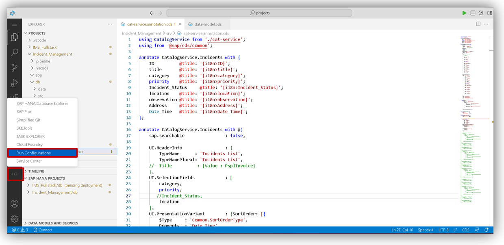
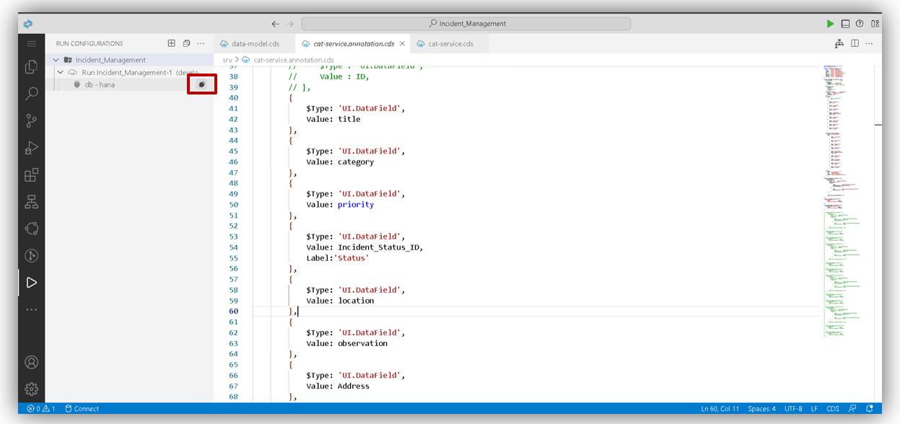

## Table of Contents

- [CAP Project Creation](#project)
- [Table Creation](#table)
- [Install dependencies](#install)
- [ Database connection and project deployment](#db)
- [Summary](#summary)


## CAP Project Creation<a name="project"></a>

1. After Creating Dev Space You’ll be redirected to your newly created SAP Business Application Studio Dev Space. Click on <b>Start Template</b> as shown below. <br><br><br>

2. Select <b>CAP Project</b> from given template and click on <b>Start.</b> <br><br><br>

3. Enter your Project name as shown below, and choose <b>Node.js</b> from runtime.<br>
Select all check boxes given below and click on <b>Finish</b> button. <br><br><br>

## CAP Table Creation<a name="table"></a>

1. Now, to create a table go to <b>db</b> folder and click on <b>data-model.cds</b> here we can write code to create a table as shown in below, here we use entity keyword to create a table followed by table name Incident <br><br><br> 

```
namespace my.Incident_Management;
using {managed} from '@sap/cds/common';
entity Incidents : managed {
  key ID              : UUID;
      title           : String(50);
      category        : String(50);
      priority        : String(50);
      Incident_Status : String(50);
      location        : String(50);
      observation     : String(50);
      Address         : String(100);
      Date_Time       : DateTime @cds.on.insert: $now;
}

```
<br>

2. Now, to expose <b>Incident</b> table to services we have to do projection of tables for which,
Go to <b>srv</b> folder and click on <b>cat-service.cds</b> and write the following code <br><br><br>

```
using my.Incident_Management as ims from '../db/data-model';
service CatalogService {
    entity Incidents     as projection on ims.Incidents;
    annotate Incidents with @odata.draft.enabled;
}

```
<br>

3.  Click on Project name create <b>i18n</b> folder <br><br><br>

4. Inside folder create <b>i8n.properties</b> file and write code as shown below <br><br><br>
```
#Common Fields
#XFLD: Label
ID  = Incident ID 
#XFLD: Label
title = Title
#XFLD: Label
category = Category 
#XFLD: Label
priority = Priority
#XFLD: Label
Incident_Status = Status
#XFLD: Label
location = Location
#XFLD: Label
observation = Is Observed?
#XFLD: Label
Address = Address
#XFLD: Label
Date_Time = Date Time

```
<br>

5. Create <b>cat-service.annotation.cds</b> file inside  <b>srv</b>  folder and write code as shown below <br><br><br>

```
using CatalogService from './cat-service';

annotate CatalogService.Incidents with {
    ID              @title : '{i18n>ID}';
    title           @title : '{i18n>title}';
    category        @title : '{i18n>category}';
    priority        @title : '{i18n>priority}';
    Incident_Status @title : '{i18n>Incident_Status}';
    location        @title : '{i18n>location}';
    observation     @title : '{i18n>observation}';
    Address         @title : '{i18n>Address}';
    Date_Time       @title : '{i18n>Date_Time}';
};

annotate CatalogService.Incidents with @(
    sap.searchable         : false,

    UI.HeaderInfo          : {
        TypeName       : 'Incidents List',
        TypeNamePlural : 'Incidents List',
    //  Title          : {Value : PsplInvoice}
    },
    UI.SelectionFields     : [
        category,
        priority ,
        Incident_Status,
        location
    ],
    UI.PresentationVariant : {SortOrder : [{
        $Type      : 'Common.SortOrderType',
        Property   : 'Date_Time',
        Descending : true
    }]},
    UI.LineItem            : [
        // {
        //     $Type : 'UI.DataField',
        //     Value : ID,
        // },
        {
            $Type : 'UI.DataField',
            Value : title
        },
        {
            $Type : 'UI.DataField',
            Value : category
        },
        {
            $Type : 'UI.DataField',
            Value : priority
        },
        {
            $Type : 'UI.DataField',
            Value : Incident_Status
        },
        {
            $Type : 'UI.DataField',
            Value : location
        },
        {
            $Type : 'UI.DataField',
            Value : observation
        },
        {
            $Type : 'UI.DataField',
            Value : Address
        },
        {
            $Type : 'UI.DataField',
            Value : Date_Time
        }


    ],
    UI.FieldGroup #GeneratedGroup1 : {
        $Type : 'UI.FieldGroupType',
        Data : [
            {
                $Type : 'UI.DataField',
                Value : ID,
            },
            {
                $Type : 'UI.DataField',
                Value : title,
            },
            {
                $Type : 'UI.DataField',
                Value : category,
            },
            {
                $Type : 'UI.DataField',
                Value : priority,
            },
            {
                $Type : 'UI.DataField',
                Value : Incident_Status,
            },
            {
                $Type : 'UI.DataField',
                Value : location,
            },
            {
                $Type : 'UI.DataField',
                Value : observation,
            },
            {
                $Type : 'UI.DataField',
                Value : Address,
            },
            {
                $Type : 'UI.DataField',
                Value : Date_Time,
            },
        ],
    },
    UI.Facets : [
        {
            $Type : 'UI.ReferenceFacet',
            ID : 'GeneratedFacet1',
            Label : 'General Information',
            Target : '@UI.FieldGroup#GeneratedGroup1',
        },
    ]
);

```
<br>

## Install dependencies <a name="install"></a>

1. Right Click on Project Name, select <b>Open in integrated Terminal</b> <br><br><br>

2. The terminal will open in the bottom right of the Business Application studio run  <b>cf login</b>  command and press enter  <br>

```
cf login

```
 <br><br>

3. Copy <b>https://api.cf.eu10-004.hana.ondemand.com </b>text in <b>API end point</b> and press enter 
```
https://api.cf.eu10-004.hana.ondemand.com

```
<br><br>

4. Enter your  <b>Email</b> and  <b>Password</b> and press enter <br><br><br>

5. Run <b>npm install </b> command and press enter 
```
npm install

```
<br><br>

6. After installation of npm packages run <b>cds build/all</b> command and press enter  
```
cds build/all

```
<br>  <br>

7. After that run <b>cds deploy --to hana</b> command and press enter
```
cds deploy --to hana

```
<br><br>


## Database connection and project deployment <a name="db"></a>

1. Click on highlighted section and select <b>Run Configuration</b> <br><br><br>

2. Click on <b>Create Configuration</b> <br><br><br>

3. After that you will get pop up Click on that and press enter. Now you can able to see Created Database Configuration open that folder and Click on  highlighted section in <b>db-hana</b> as shown in below <br><br><br>

4. You will get pop up Click on <b>Incident Management-db hana(hdi-shared)</b> <br><br><br>

5. Click on <b>Yes</b> <br><br><br>

6. Now you are successfuly conected to  <b>Hana Database</b> <br><br><br>

7. On left side you can able to see <b>mta.yml</b> file right click on that and select <b>Built MTA Project</b> <br><br><br> <br><br><br> 

8. On left side <b>mta archives</b> folder will be created open <b>mta archives</b> inside that <b>Project_name.mtar</b> file able to see  right click on that and select <b>Deploy MTA Archive</b> <br><br>
<br> <br><br><br> 

9. After Deployment on project you will get service link as shown in below<br><br><br>

10. Copy Service link and paste in new tab of browser and press enter.  <br><br><br>

## Summary <a name="summary"></a>

You have now successfully Created SAP BTP CAP project .

Continue to - [Exercise 3 -3_Create an SAP Fiori Elements-Based UI ](../3_Create%20an%20SAP%20Fiori%20Elements-Based%20UI/Readme.md) 