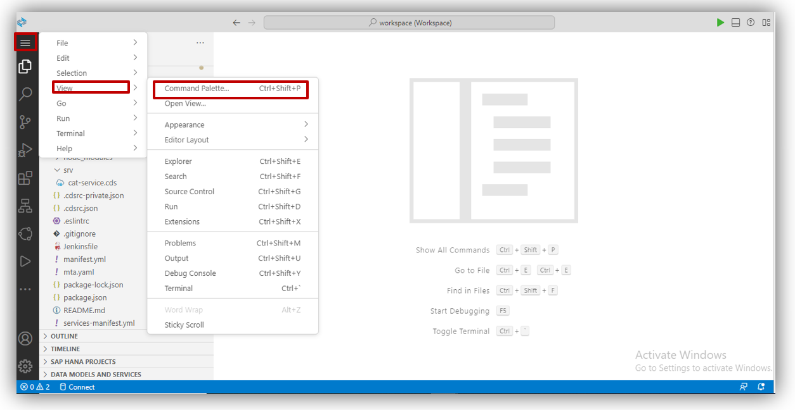
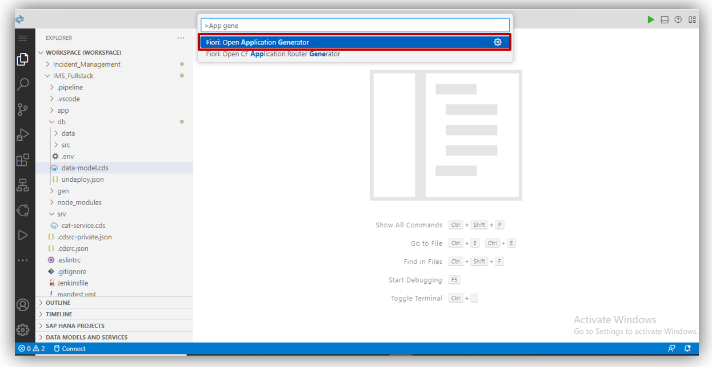
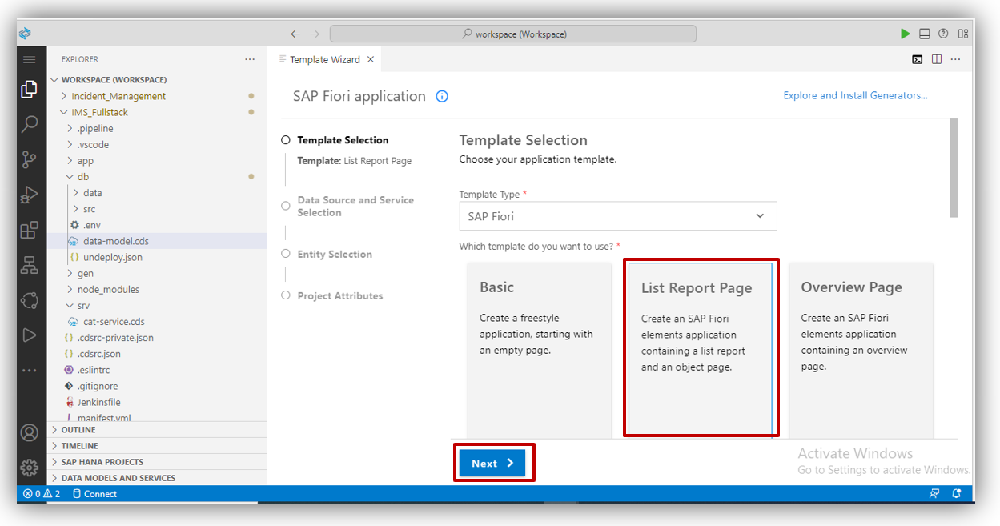
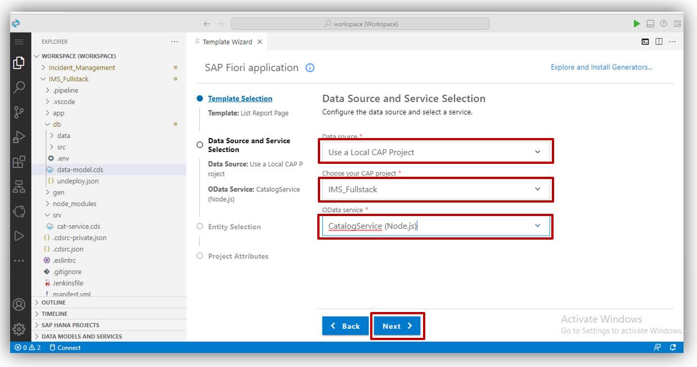
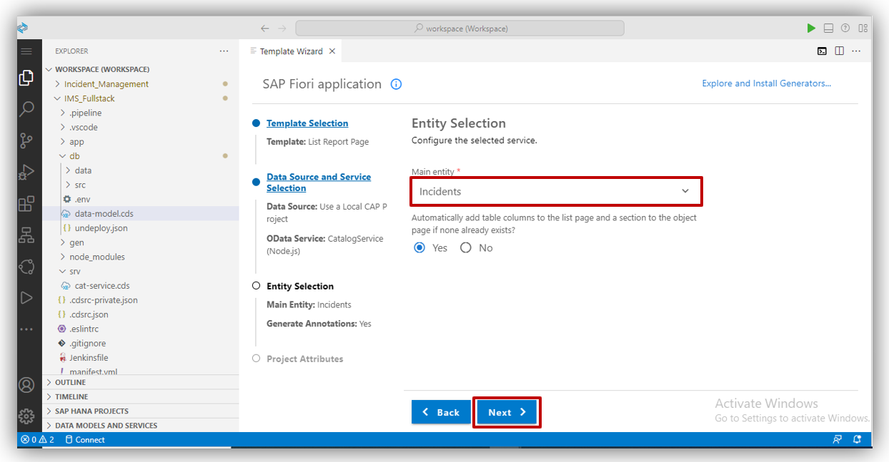
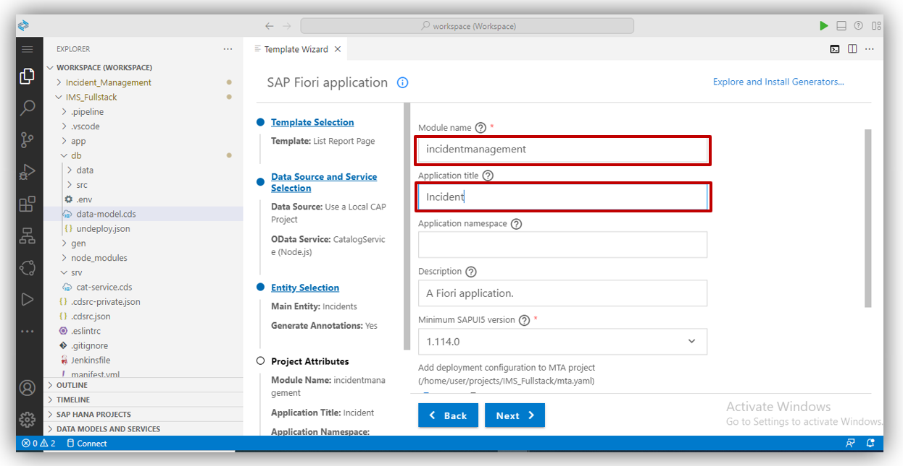
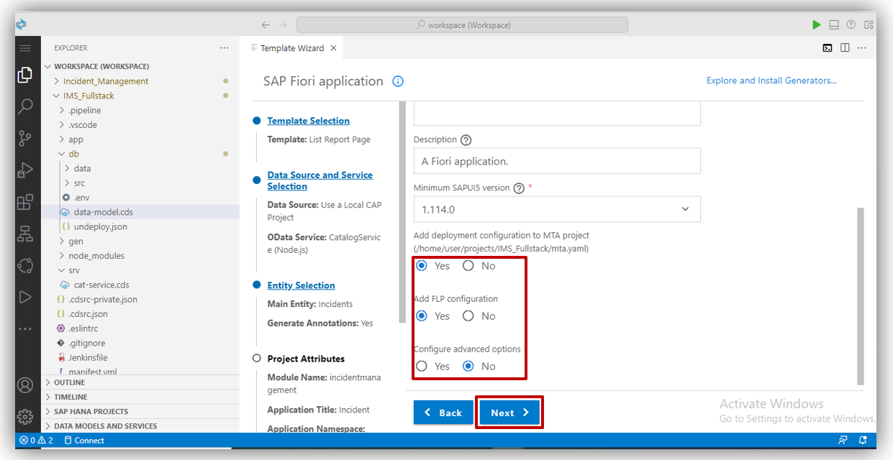
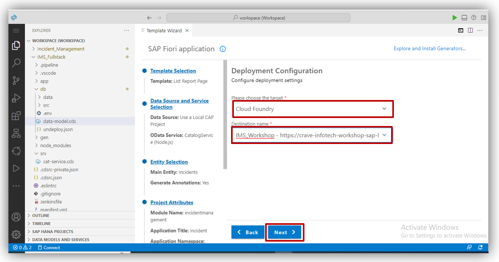
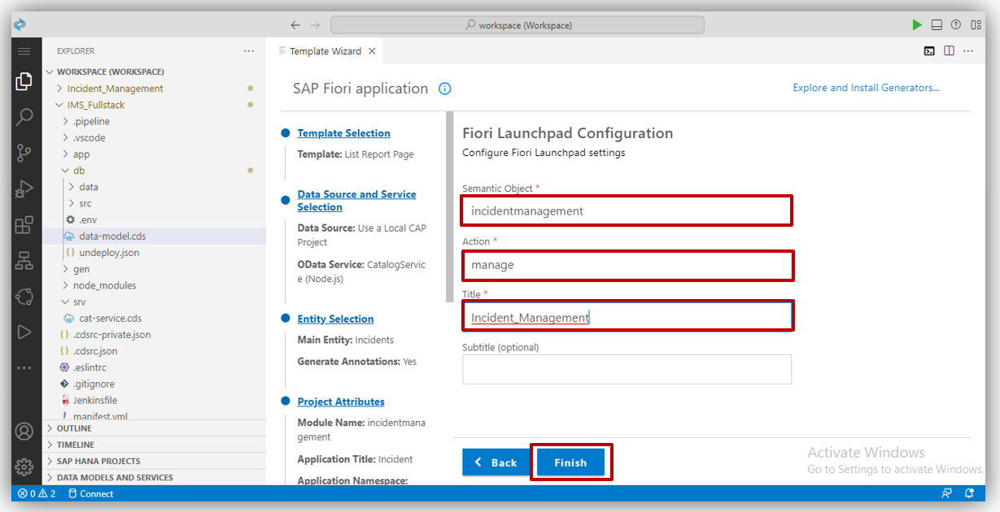
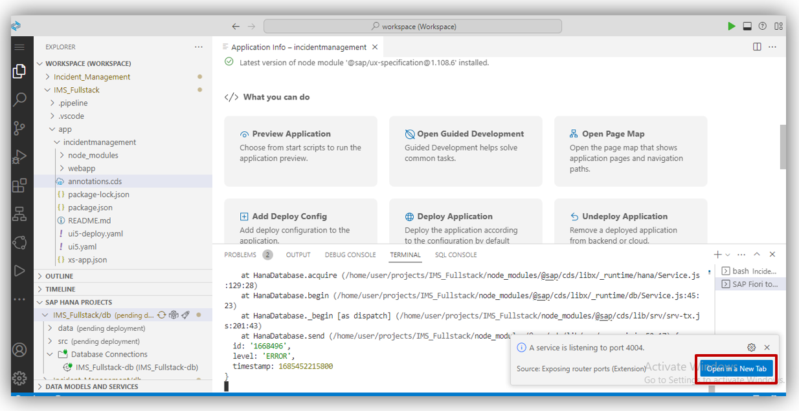

## Table of Contents
 - [Overview](#section1)
 - [Create an SAP Fiori Elements-Based UI](#section2)
 - [Summary](#summary)

### Overview 

In this exercise, we will create UI from local CAP project for SAP Fiori Element.

 

## Create an SAP Fiori Elements-Based UI 

1. For Creating <b>SAP Fiori Elements-Based UI </b> click on menu tab as shown in below. 
then select <b>View </b> from menu and then select <b>Command Palatte. </b>  

2. Then search for <b> Application Generator </b>and select <b> Fiori:Open Application Generator </b> 
 

3. Now Template Wizard open. 
Select <b>List Report Page.</b> and click on<b> Next Button.</b>    

4. Select Data Source as <b>Use a Local CAP Project</b>
Choose your CAP Project which you have created earlier.
Then select oData Service and click on <b>Next</b> button. 
 

5. Select your main entity which you want to show in list page. 
Click on <b>Next</b> button.
  

6. Give module name as your project name.
note : module name should be in small letter and without space.
Give a Application Title. Also give application name if you want
Choose radio button as shown in below.
Click on <b>Next</b> button.
    

- For deployment configuration of MTA project choose "<b>Yes</b>"
- For adding FLP Configuration choose "<b>Yes</b>" otherwise you can choose "<b>No</b>"
- We don't require advance configuration so choose "<b>No</b>"
  

7. Choose the target as <b>Cloud Foundry</b> for your deployment configuration. 
Select Destination name which you have created, and click on <b>Next</b> button.
  

8. Give semantic object Give <b>manage</b> in Action field. Give <b> Application title</b> in title field. And subtitle is optional you give if you want.
click on <b>Finish button.</b>
  

8. Now <b>SAP Fiori Elements-Based UI</b> is created.
Then, Select <b>Preview Application</b>.
Then you will get pop-up message, click on <b>Open in new Tab</b> as shown in below.
  
 

 9. <b>SAP Fiori Elements-Based UI</b> is ready. 
  

 

## Summary

You have now acquired <b>SAP Fiori Elements-Based UI</b>.

Continue to - [Exercise 4 - Enhance the Fiori Element Application.](../4_Enhance%20the%20Fiori%20Element%20Application%20with%20annotation/Readme.md)
