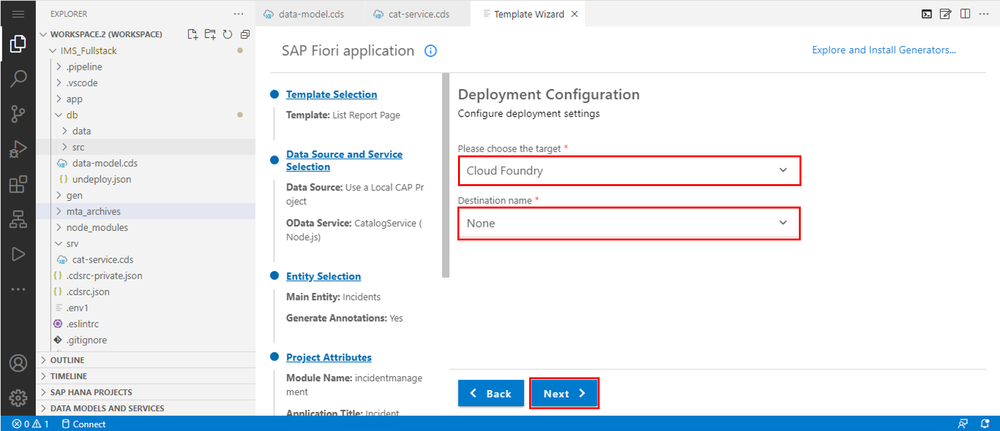
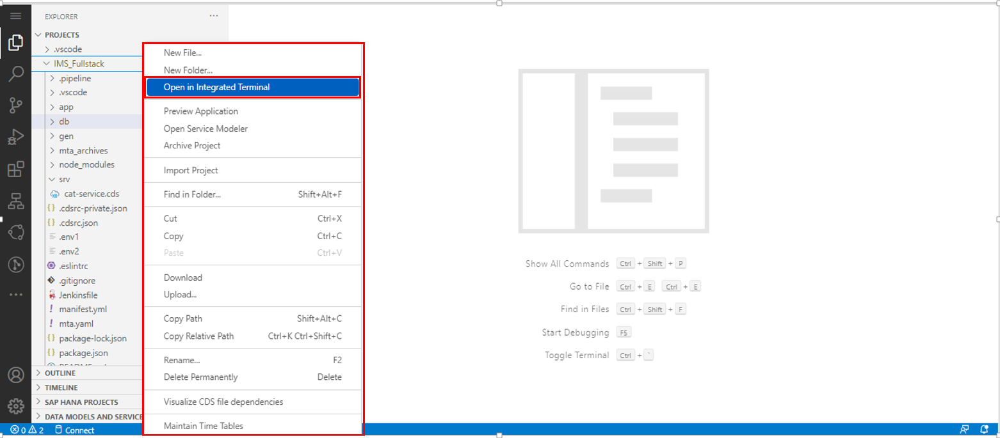
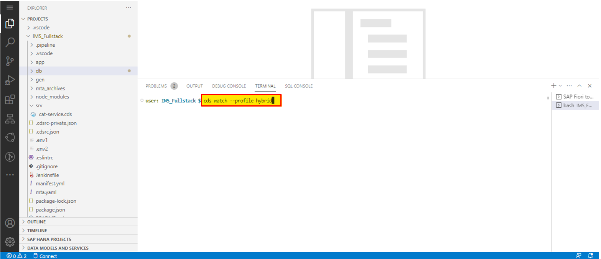
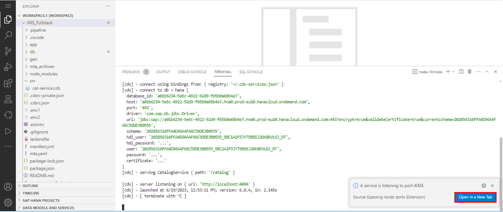
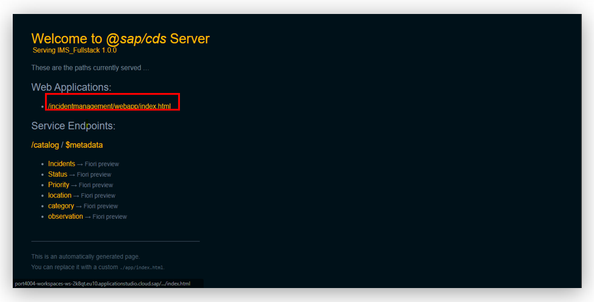

## Table of Contents
 - [Overview](#section1)
 - [Create an SAP Fiori Elements-Based UI](#section2)
 - [Summary](#summary)


### Overview <a name="section1"></a>

In this exercise, we will create UI from local CAP project using SAP Fiori Elements.

 

## Create an SAP Fiori Elements-Based UI <a name="section2"></a>

1. For Creating <b>SAP Fiori Elements-Based UI </b> click on menu tab as shown in below.<br>
then select <b>View </b> from menu and then select <b>Command Palatte. </b><br><br>

2. Then search for <b> Application Generator </b>and select <b> Fiori:Open Application Generator </b><br>
<br>

3. Now Template Wizard open.<br>
Select <b>List Report Page.</b> and click on<b> Next Button.</b>  <br><br>

4. Select Data Source as <b>Use a Local CAP Project</b>
Choose your CAP Project which you have created earlier.
Then select oData Service and click on <b>Next</b> button.<br>
<br>

5. Select your main entity which you want to show in list page.<br>
Click on <b>Next</b> button.
<br><br>

6. Give module name as your project name.<br>
<b>Note </b>: module name should be in small letter and without space.
Give a Application Title. Also give application name if you want
Choose radio button as shown in below.
Click on <b>Next</b> button.
<br><br><br><br>

- For deployment configuration of MTA project choose "<b>Yes</b>"
- For adding FLP Configuration choose "<b>Yes</b>" otherwise you can choose "<b>No</b>"
- We don't require advance configuration so choose "<b>No</b>"
<br><br>

7. Choose the target as <b>Cloud Foundry</b> for your deployment configuration.<br>
Select Destination name as <b>None</b>, and click on <b>Next</b> button.
<br><br>

8. Give semantic object , Give <b>manage</b> in Action field , Give <b> Application title</b> in title field. And subtitle is optional you can give if you want.
click on <b>Finish button.</b>
<br><br>

9. Right Click on <b>IMS_Fullstack</b>, select <b>Open in integrated Terminal</b> <br><br><br>

10. The terminal will open in the bottom right of the Business Application studio  run  <b>cds watch --profile hybrid</b>  command and press enter  <br>

```
cds watch --profile hybrid

```
 <br><br>

 11. Now you will receive a pop up of <b>A service is listing to port 4004</b> Click on <b>Open New Tab</b>. 
<br><br><br><br>

 12. You will redirected to new tab Click on Web Application link as shown below
<br><br><br><br>

13. Now we have sucessfully created Fiori Application

 


## Summary<a name="summary"></a>

You have now acquired <b>SAP Fiori Elements-Based UI</b>.

Continue to - [Exercise 4 - Enhance the Fiori Element Application.](../4_Enhance%20the%20Fiori%20Element%20Application%20with%20annotation/Readme.md)
