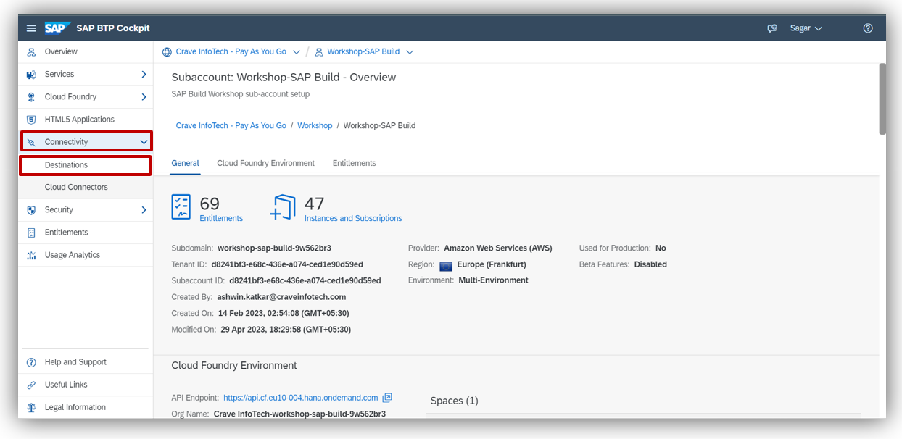
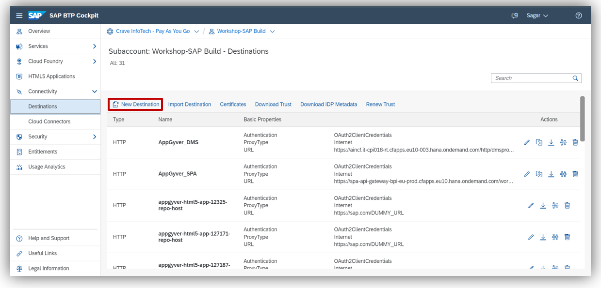
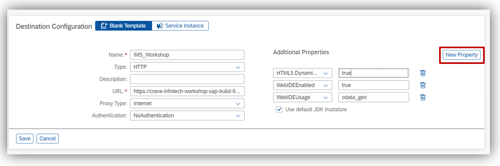
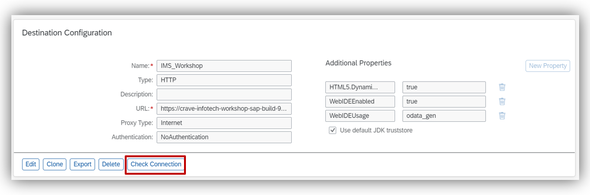
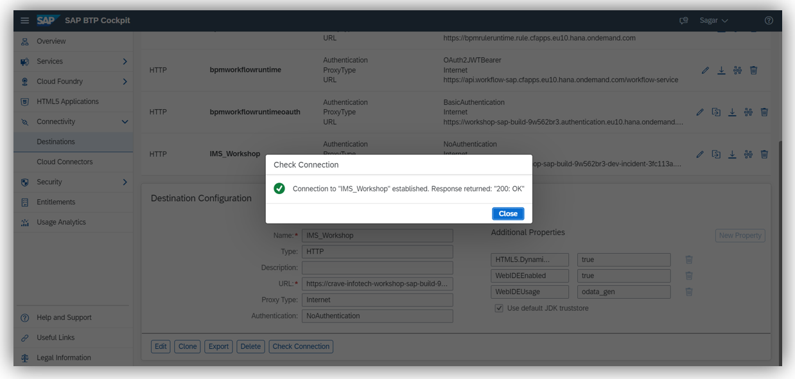
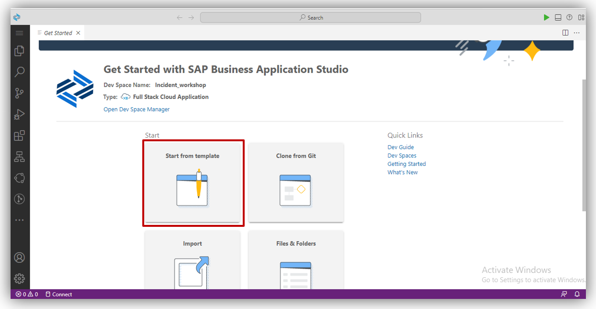
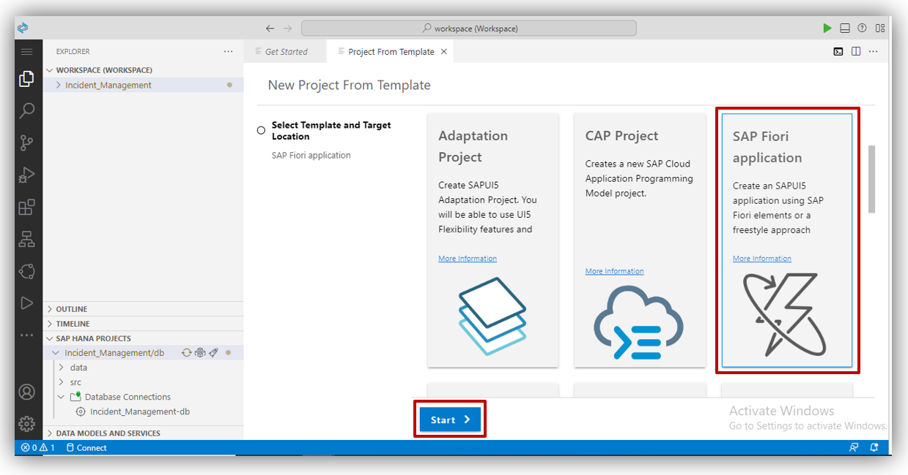
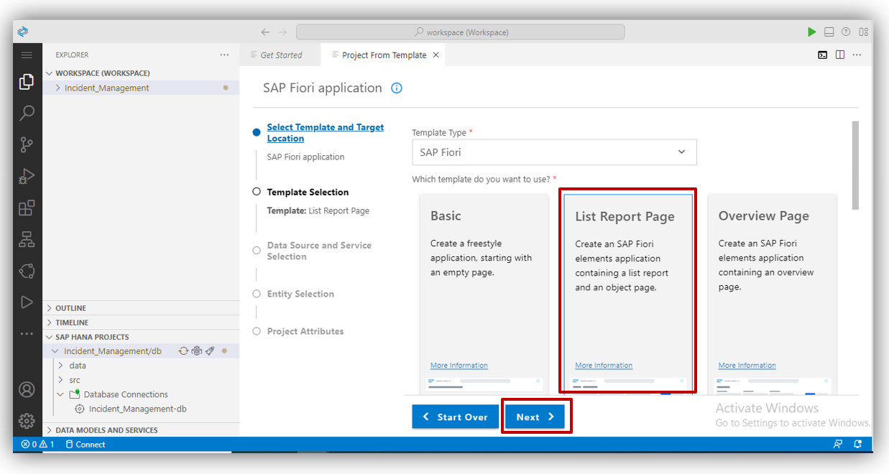

## Table of Contents
 - [Overview](#overview)
 - [Create Destination](#destination)
 - [Create SAP Fiori Application](#FioriApp)

 - [Summary](#summary)

### Overview 

In this exercise you will learn:

- How to create destination to consume CAPM service.
- How to Create SAP Fiori Application.

## Create Destination 

1. For Consuming CAPM service we need to create destination> click on given link  
-   [- Click here](https://emea.cockpit.btp.cloud.sap/cockpit/#/globalaccount/af288739-c527-4b65-b66d-0ed5e4010878/subaccount/d8241bf3-e68c-436e-a074-ced1e90d59ed/subaccountoverview)
 

2. Click on <b>Connevtivity</b> and select <b>Destination</b> as given below  
    

3. Click on <b>New Destination</b>.  
    

4. Write IMS_Workshop in <b>Name</b> field. In type select <b>HTTP</b>. In <b>URL</b> field paste your CAPM project service link. Keep <b>Proxy Type</b> <b>Internet</b>, Authentication field select <b>No Authentication</b>. 
After this select <b>New Property</b>
- HTML5Dynamic Destination <b>-> true</b>
- WebIDEEnabled <b>-> true</b>
- WebIDEUsage <b>-> odata_gen</b>
Click on <b>Save </b>button.
  

5. Click on <b>Check conection</b>
  

6. We successfully created Destination, and click on <b>Close</b>.
  

## Create SAP Fiori Application 

1. Go to your Bussiness Application Studio (BAS).

2. Select <b>Start from template.</b>
  

2. Select <b>SAP Fiori Application</b> and click on <b>Start</b>.
  

3. Select <b>List Report Page</b> and click on <b>Next</b>.
  

4. Select <b>onnect to a system</b>in <b>Data Source</b>Select <b>IMS_Workshop</b>in <b>System</b>and write <b>/catlog</b> in <b>Service path</b> and click on <b>Next</b>.
  

## Summary 

You have now created API Triggers for the Business Process.

Continue to - [Exercise 5 - Modify the Automation](../5_ModifyAutomation/Readme.md)
