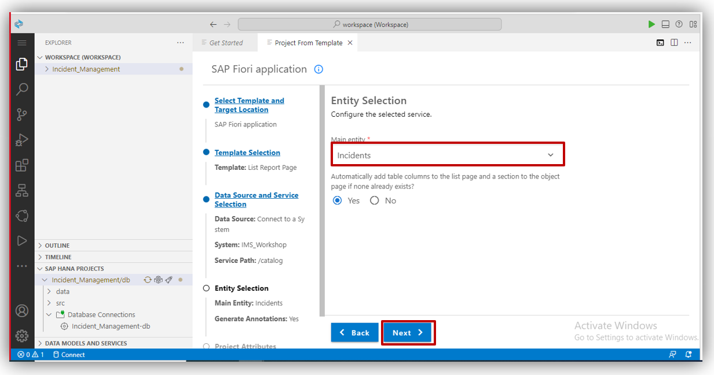

## Table of Contents
 - [Overview](#overview)
 - [Create SAP Fiori Application](#FioriApp)

 - [Summary](#summary)

### Overview 

In this exercise you will learn:

- How to Create SAP Fiori Application.

## Create SAP Fiori Application 

1. Go to your Bussiness Application Studio (BAS). and click on menu icon.
 

After that you can select <b> Help </b> and then select <b> Get Started </b> 
 

2. Select <b>Start from template.</b>
 

3. Select <b>SAP Fiori Application</b> and click on <b>Start</b>.
 

4. Select <b>List Report Page</b> and click on <b>Next</b>.
  

5. Select <b> Connect to a system </b> in <b> Data Source </b> Select <b> Your project </b> in <b> System</b> and Give <b> /catlog </b> in your <b> Service path</b>
For example : https://crave-infotech-workshop-sap-build-9w562br3-dev-ims-full75303b83.cfapps.eu10-004.hana.ondemand.com/catalog/Incidents <b> /catalog </b> is your sevice path in above example. and click on <b>Next</b>.
 

6. Select your main entity which you want to show in list page in <b>Main Entity</b> and click on <b>Next</b>.
 

7.  Give module name as your project name.<b>Module name</b>. 
- note: Module name should be <b>lowercase</b> and without space. 
and choose the option as shown in below and click on <b>Next</b>.
 

 
- For deployment configuration of MTA project choose "<b>Yes</b>"
- For adding FLP Configuration choose "<b>Yes</b>" otherwise you can choose "<b>No</b>"
- We don't require advance configuration so choose "<b>No</b>"

8. Plese choose target as <b>Cloud Foundry</b> and choose destination as shown below and click on <b>Finish</b>.
 

9. We successfully created <b>SAP Fiori Application</b>. 
Click on <b>Preview Application</b>.
 

10. Select the <b>start-noflp fiori run</b> option from the list, as shown given below.
 

11. Here we can see the  SAP Fiori Application. 
 

## Summary 

You have now created SAP Fiori Application using destination.