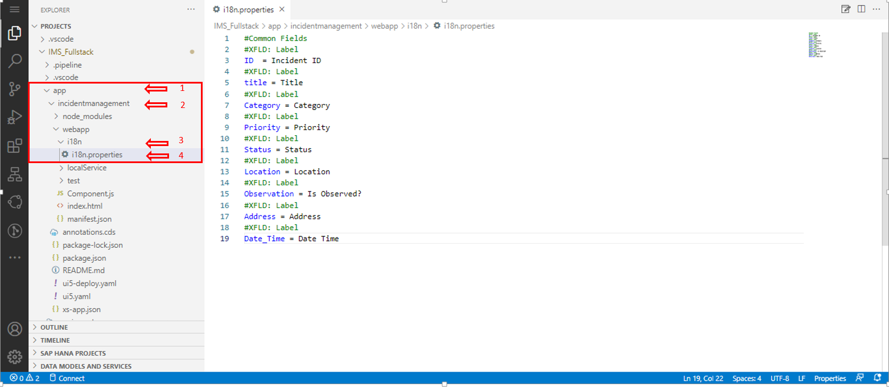

## Table of Contents
 - [Overview](#overview)
 - [Build Fiori APP using cds Annotation ](#annotation)
 - [Summary](#summary)

### Overview <a name="overview"></a>

In this exercise you will learn:

- How to enhance SAP Fiori Elements Application in existing CAP Project.<br><br>


### Build Fiori App using cds annotation <a name="annotation"></a>

1. Now to add annotation open app-->incidentmanagement-->webapp-->i18n inside  <b>i18n</b> folder open <b>i8n.properties</b> file and replace previous code with below code as shown below <br><br>

```
#Common Fields
#XFLD: Label
ID  = Incident ID 
#XFLD: Label
title = Title
#XFLD: Label
Category = Category 
#XFLD: Label
Priority = Priority
#XFLD: Label
Status = Status
#XFLD: Label
Location = Location
#XFLD: Label
Observation = Is Observed?
#XFLD: Label
Address = Address
#XFLD: Label
Date_Time = Date Time


```
<br><br> <br>

2. In app folder you will find <b>annotation.cds</b> file open <b>annotation.cds</b>file and replace previous code with below code as shown below <br><br><br>

```
using CatalogService from '../../srv/cat-service';
using from '@sap/cds/common';

annotate CatalogService.Incidents with {
    ID          @title: '{i18n>ID}';
    title       @title: '{i18n>title}';
    category    @title: '{i18n>Category}';
    Priority    @title: '{i18n>Priority}';
    Status      @title: '{i18n>Status}';
    Location    @title: '{i18n>Location}';
    Observation @title: '{i18n>Observation}';
    Address     @title: '{i18n>Address}';
    Date_Time   @title: '{i18n>Date_Time}';
};

annotate CatalogService.Incidents with @(
    sap.searchable                : false,

    UI.HeaderInfo                 : {
        TypeName      : 'Incidents List',
        TypeNamePlural: 'Incidents List',
    },
    UI.SelectionFields            : [
        category_ID,
        Priority_ID,
        Status_ID,
        Location_ID
    ],
    UI.PresentationVariant        : {SortOrder: [{
        $Type     : 'Common.SortOrderType',
        Property  : 'Date_Time',
        Descending: true
    }]},
    UI.LineItem                   : [
        {
            $Type: 'UI.DataField',
            Value: title,
            Label: 'Title'
        },
        {
            $Type: 'UI.DataField',
            Value: category_ID,
            Label: 'Category'
        },
        {
            $Type: 'UI.DataField',
            Value: Priority_ID,
            Label: 'Priority'
        },
        {
            $Type: 'UI.DataField',
            Value: Status_ID,
            Label: 'Status'
        },
        {
            $Type: 'UI.DataField',
            Value: Location_ID,
            Label: 'Location'
        },
        {
            $Type: 'UI.DataField',
            Value: Observation_ID,
            Label: 'Observation'
        },
        {
            $Type: 'UI.DataField',
            Value: Address
        },
        {
            $Type: 'UI.DataField',
            Value: Date_Time,
            Label: 'Date Time'
            
        }
        


    ],
    UI.FieldGroup #GeneratedGroup1: {
        $Type: 'UI.FieldGroupType',
        Data : [
            {
                $Type: 'UI.DataField',
                Value: ID,
            },
            {
                $Type: 'UI.DataField',
                Value: title,
            },
            {
                $Type: 'UI.DataField',
                Value: category_ID,
                Label: 'Category'
            },
            {
                $Type: 'UI.DataField',
                Value: Priority_ID,
                Label: 'Priority'
            },
            {
                $Type: 'UI.DataField',
                Value: Status_ID,
                Label: 'Status'
            },
            {
                $Type: 'UI.DataField',
                Value: Location_ID,
                Label: 'Location'
            },
            {
                $Type: 'UI.DataField',
                Value: Observation_ID,
                Label: 'Observation'
            },
            {
                $Type: 'UI.DataField',
                Value: Address,
            },
            {
                $Type: 'UI.DataField',
                Value: Date_Time,
            }
        ],
    },
    UI.Facets                     : [{
        $Type : 'UI.ReferenceFacet',
        ID    : 'GeneratedFacet1',
        Label : 'General Information',
        Target: '@UI.FieldGroup#GeneratedGroup1',
    }, ]
);

annotate CatalogService.Incidents with {
    Status @(
        Common.ValueList               : {
            $Type         : 'Common.ValueListType',
            CollectionPath: 'Status',
            Parameters    : [
                {
                    $Type            : 'Common.ValueListParameterInOut',
                    LocalDataProperty: Status_ID,
                    ValueListProperty: 'ID',
                },
                {
                    $Type            : 'Common.ValueListParameterDisplayOnly',
                    ValueListProperty: 'SName',
                }
            ],
        },


        Common.ValueListWithFixedValues: true
    )
};

annotate CatalogService.Status with {
    ID @Common.Text: {
        $value                : SName,
        ![@UI.TextArrangement]: #TextOnly,
    }
};

annotate CatalogService.Incidents with {
    Status @Common.Text: {
        $value                : Status.SName,
        ![@UI.TextArrangement]: #TextOnly,
    }
};

annotate CatalogService.Incidents with {
    Priority @(
        Common.ValueList               : {
            $Type         : 'Common.ValueListType',
            CollectionPath: 'Priority',
            Parameters    : [
                {
                    $Type            : 'Common.ValueListParameterInOut',
                    LocalDataProperty: Priority_ID,
                    ValueListProperty: 'ID',
                },
                {
                    $Type            : 'Common.ValueListParameterDisplayOnly',
                    ValueListProperty: 'PName',
                }
            ],
        },


        Common.ValueListWithFixedValues: true
    )
};

annotate CatalogService.Priority with {
    ID @Common.Text: {
        $value                : PName,
        ![@UI.TextArrangement]: #TextOnly,
    }
};

annotate CatalogService.Incidents with {
    Priority @Common.Text: {
        $value                : Priority.PName,
        ![@UI.TextArrangement]: #TextOnly,
    }
};

annotate CatalogService.Incidents with {
    Location @(
        Common.ValueList               : {
            $Type         : 'Common.ValueListType',
            CollectionPath: 'location',
            Parameters    : [
                {
                    $Type            : 'Common.ValueListParameterInOut',
                    LocalDataProperty: Location_ID,
                    ValueListProperty: 'ID',
                },
                {
                    $Type            : 'Common.ValueListParameterDisplayOnly',
                    ValueListProperty: 'LName',
                }
            ],
        },


        Common.ValueListWithFixedValues: true
    )
};

annotate CatalogService.location with {
    ID @Common.Text: {
        $value                : LName,
        ![@UI.TextArrangement]: #TextOnly,
    }
};

annotate CatalogService.Incidents with {
    Location @Common.Text: {
        $value                : Location.LName,
        ![@UI.TextArrangement]: #TextOnly,
    }
};

annotate CatalogService.Incidents with {
    category @(
        Common.ValueList               : {
            $Type         : 'Common.ValueListType',
            CollectionPath: 'category',
            Parameters    : [
                {
                    $Type            : 'Common.ValueListParameterInOut',
                    LocalDataProperty: category_ID,
                    ValueListProperty: 'ID',
                },
                {
                    $Type            : 'Common.ValueListParameterDisplayOnly',
                    ValueListProperty: 'CName',
                }
            ],
        },


        Common.ValueListWithFixedValues: true
    )
};

annotate CatalogService.category with {
    ID @Common.Text: {
        $value                : CName,
        ![@UI.TextArrangement]: #TextOnly,
    }
};

annotate CatalogService.Incidents with {
    category @Common.Text: {
        $value                : category.CName,
        ![@UI.TextArrangement]: #TextOnly,
    }
};

annotate CatalogService.Incidents with {
    Observation @(
        Common.ValueList               : {
            $Type         : 'Common.ValueListType',
            CollectionPath: 'observation',
            Parameters    : [
                {
                    $Type            : 'Common.ValueListParameterInOut',
                    LocalDataProperty: Observation_ID,
                    ValueListProperty: 'ID',
                },
                {
                    $Type            : 'Common.ValueListParameterDisplayOnly',
                    ValueListProperty: 'OName',
                }
            ],
        },


        Common.ValueListWithFixedValues: true
    )
};

annotate CatalogService.observation with {
    ID @Common.Text: {
        $value                : OName,
        ![@UI.TextArrangement]: #TextOnly,
    }
};

annotate CatalogService.Incidents with {
    Observation @Common.Text: {
        $value                : Observation.OName,
        ![@UI.TextArrangement]: #TextOnly,
    }
};


```
<br>

3. Right Click on IMS_Fullstack, select <b>Open in integrated Terminal</b> <br><br>
<br>

4. Run <b>cds build/all</b> command and press enter 

```
cds build/all

```
<br> <br><br>

5. After sucessfully completion of build command we can able to see <b>build completed</b> as shown in image <br><br> <br>

6. Run <b>cds deploy --to hana</b> command and press enter <br>

```
cds deploy --to hana

```
<br> <br>

7.  After sucessfully completion of deploy command we can able to see <b>done</b> as shown in image <br><br> <br>


8. Run  <b>cds watch --profile hybrid</b>  command and press enter  <br>

```
cds watch --profile hybrid

```
 <br><br>

 9. Now you will receive a pop up of <b>A service is listing to port 4004</b> Click on <b>Open New Tab</b>. 
<br><br><br><br>

 10. Click on Web Application link as shown below ,you will redirected to new tab <br>
 <b>Note</b>: If below window is already opened you can skip  8 and 9 step.Refresh the page and Click on highlighted WebLink.
<br><br><br><br>

11. Now your application is successfully Created Enhanced SAP Foiri Application . 


 

## Summary <a name="summary"></a>

You have now created SAP Fiori Application .
